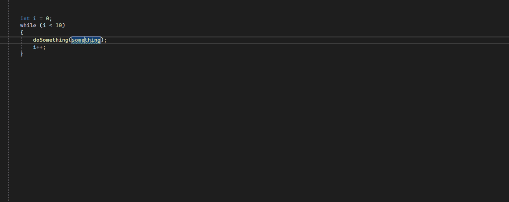

[](https://www.nuget.org/packages/djsleurink.Analyzers.MethodGroupAnalyzer)
# Analyzer: Method groups used within iterators

Analyzer that detects unnecesary memory allocation caused by the usage of method groups and provides possible solutions to fix this issue.

The issue is fixed as of .NET 7.0 so the analyzer will not be used in projects targeting .NET 7.0 or higher.


### This analyzer is applicable to:
Method groups of type System.Action and System.Func (and all it's generic variations)


## The issue:

When using a method group inside an iterator a new instance of the System.Action or System.Func type will be created on every iteration.

C#: 
```
for (int i = 0; i < 100_000; i++)
{
    doSomething(something);
}
```

Intermediate language:

```
for (int i = 0; i < 100000; i++)
{
    doSomething(new Action(something)); //a System.Action object is created on every iteration
}
```


### Solution 1: 
Declare a local variable outside of the loop

```
var methodGroupVariable = new Action(something);
for (int i = 0; i < 100000; i++)
{
    doSomething(methodGroupVariable);
}
```

### Solution 2 (only available when using C# 9.0+ and target framework < .NET 7):

Declare a static lambda expression

```
for (int i = 0; i < 100000; i++)
{
    doSomething(static () => { something(); } );
}
```


### Example:

